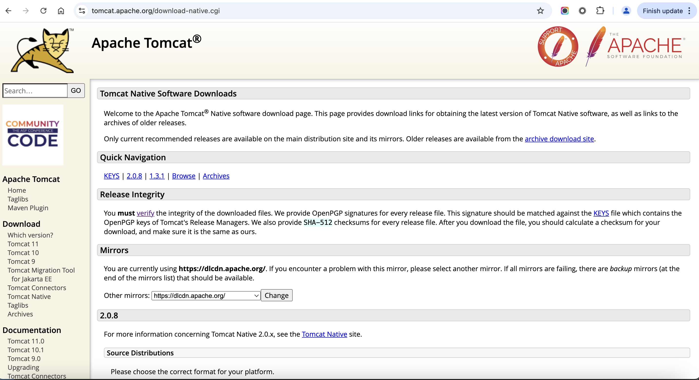
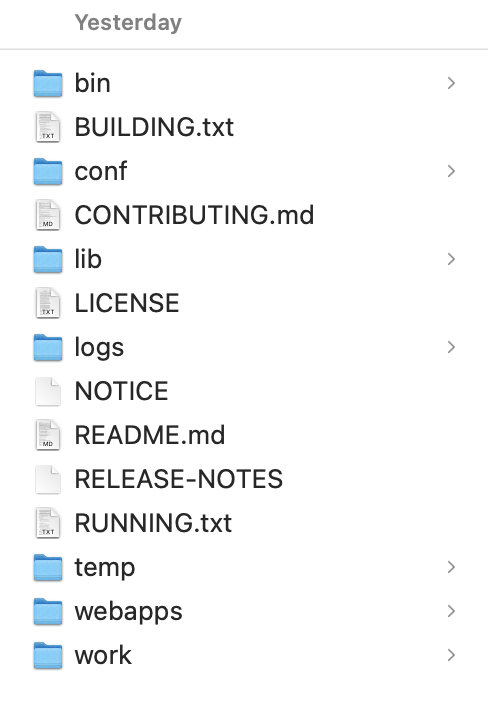
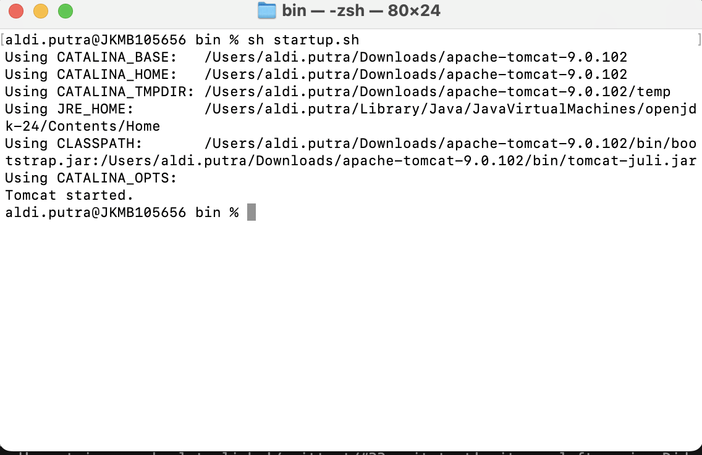
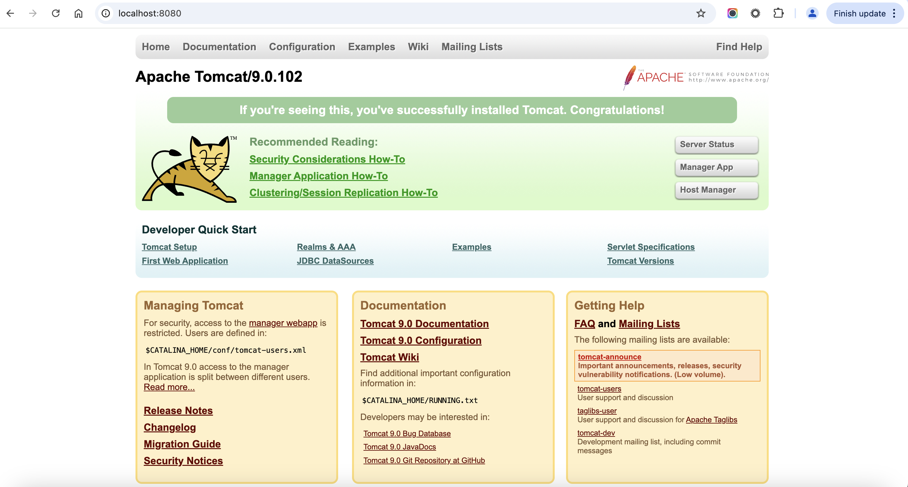
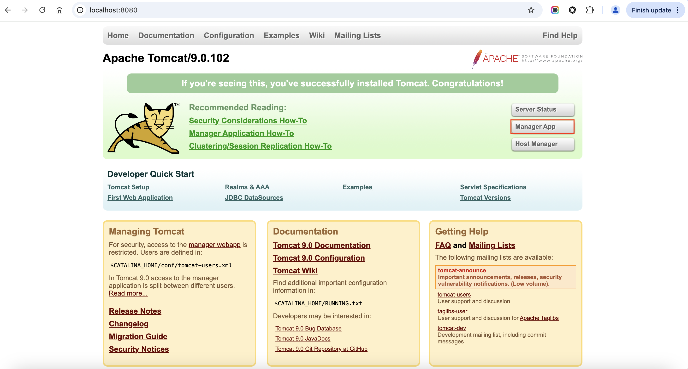
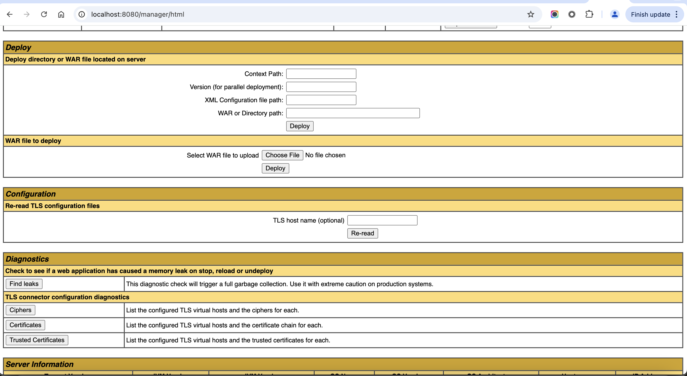

# 7. Build and Deploy

## 7.1. Download Apache Tomcat
Go to the Apache Tomcat Downloads page.

Select the appropriate Tomcat version (e.g., Tomcat 9) and download the tar.gz binary distribution.

 

Click on the tar.gz link to download it.

Alternatively, you can use the following command to download Tomcat using wget:

wget https://downloads.apache.org/tomcat/tomcat-9/v9.0.60/bin/apache-tomcat-9.0.60.tar.gz

## 7.2. Extract the Tomcat Archive
Once the download is complete, open the Terminal, navigate to the directory where the file was downloaded, and extract it:

tar -xzvf apache-tomcat-9.0.60.tar.gz

This will extract the files to a folder named apache-tomcat-9.0.60.

 

## 7.3. How to Install Apache Tomcat

After we unpackage the file, now we see file apache tomcat. Open terminal and go to path below:

/apache-tomcat-9.0.102/bin 

Running the apahce:

sh startup.sh sh

 

Now we can see tomcat apache in browser with open url:

http://localhost:8080/

 

## 7.4. Deploy Jar/War in Apache Tomcat

Open url :
http://localhost:8080/

click "app manager" button

in section "WAR file to deploy", we click choose file.

After chose file, now click button deploy.

After success, we can hit the service.

