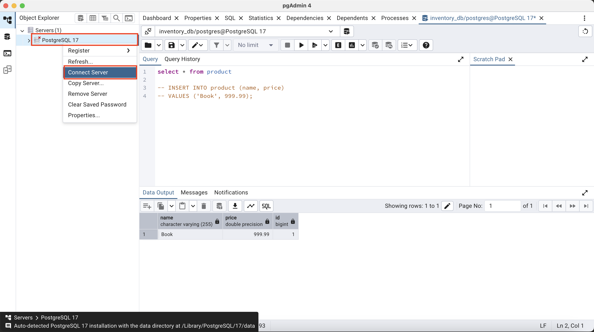
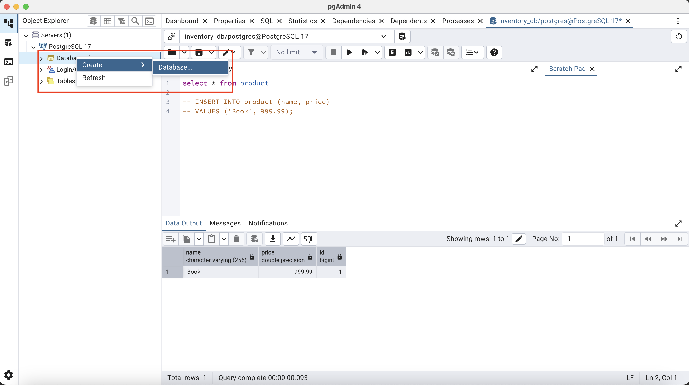
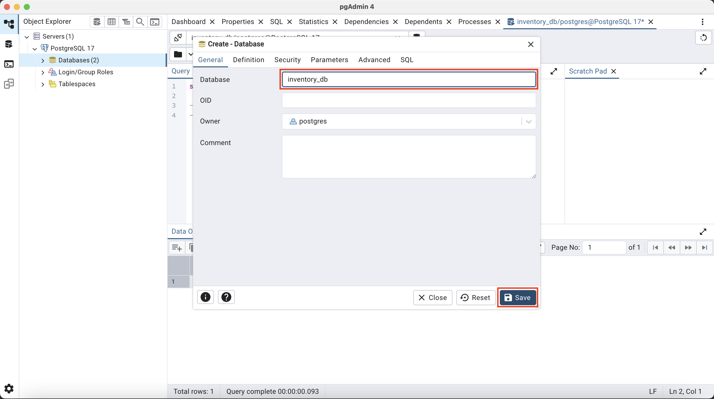
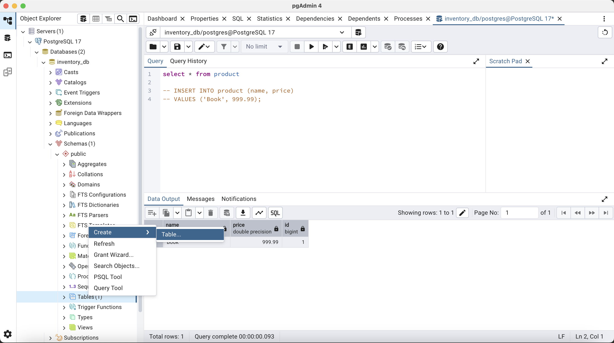
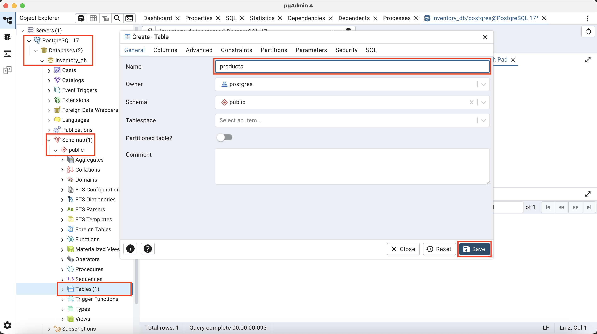
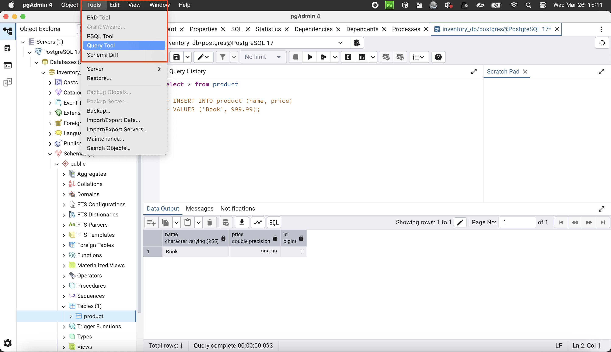
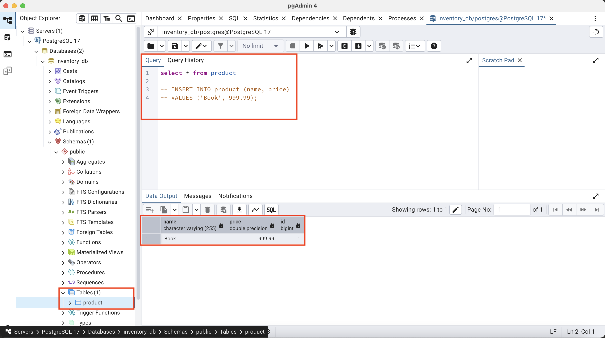

# 4. Integrated DB
## 4.1. Install the database (E.g: PostgreSQL)
* Step 1 -> [Download PostgreSQL](https://www.enterprisedb.com/downloads/postgres-postgresql-downloads)
* Step 2 -> Run `pgAdmin` and start the server

* Step 3 -> Create new database

* Step 4 -> Enter `database name` and `save`

* Step 5 -> Right Clicks on `Tables` then `Create -> Table`

* Step 6 -> Add new `tables` to database (E.g: product)

* Step 7 -> Tables has been added then go to `Query Tool`

* Step 8 -> Enter your `Query` then executed


## 4.2. Database configuration (E.g: PostgreSQL)
* Apply this configuration to `application.properties`
```
# JDBC URL for PostgreSQL
spring.datasource.url=jdbc:postgresql://localhost:5432/inventory_db

# PostgreSQL username and password
spring.datasource.username=postgres
spring.datasource.password=admin

# Set the JPA dialect to PostgreSQL
spring.jpa.properties.hibernate.dialect=org.hibernate.dialect.PostgreSQLDialect

# Enable JPA/Hibernate automatic DDL (optional: update your database schema on app start)
spring.jpa.hibernate.ddl-auto=update

# Show SQL queries in the console (optional)
spring.jpa.show-sql=true

# Format SQL queries (optional)
spring.jpa.properties.hibernate.format_sql=true
```

## 4.3. Dependencies (E.g: PostgreSQL)
* Add new dependencies to `pom.xml`
```
<dependency>
    <groupId>org.postgresql</groupId>
    <artifactId>postgresql</artifactId>
    <scope>runtime</scope>
</dependency>

<dependency>
    <groupId>org.springframework.boot</groupId>
    <artifactId>spring-boot-starter-data-jpa</artifactId>
</dependency>
```

## 4.4. Connecting with the model
* Import packages
```
import jakarta.persistence.Entity;
import jakarta.persistence.GeneratedValue;
import jakarta.persistence.GenerationType;
import jakarta.persistence.Id;
import jakarta.persistence.Table;
```
* How to use `@Entity` & `@Table`, table name of the database (e.g: product)
```
@Entity
@Table(name="product")
public class Product {
}
```
* Change `Id` to `primary key` and make it `auto generate` (! Important)
```
public class Product {
    @Id
    @GeneratedValue(strategy = GenerationType.IDENTITY)
    private long id;
}
```
* Add constructor (! Important)
```
public class Product {
    public Product() {
    }

    // Other constructors or methods if necessary
}
```

## 4.5. Connect with JPA Repository
* Step 1 -> Create Repository
```
package com.example.product.repository;

import com.example.product.model.Product;
import org.springframework.stereotype.Repository;

@Repository

public class ProductRepository {
}
```
* Step 2 -> JpaRepository Implementation
    * Change class to interface and extends with `JpaRepository`
```
import com.example.product.model.Product;
import org.springframework.stereotype.Repository;
import org.springframework.data.jpa.repository.JpaRepository;

@Repository

public interface ProductRepository extends JpaRepository<Product, Long> {
    // Other constructors or methods if necessary
}
```
* Step 3 -> Some constructors will be automatically added to the repository
```
List<Product> findAll(String name);
List<Product> findById(long id);
```
* Step 4 -> Example Product Service
```
package com.example.product.service;

import com.example.product.model.Product;
import org.springframework.stereotype.Service;
import com.example.product.repository.ProductRepository;

import java.util.List;
import java.util.Optional;

@Service
public class ProductService {

    private final ProductRepository productRepository;

    public ProductService(ProductRepository productRepository) {
        this.productRepository = productRepository;
    }

    public List<Product> getAllProducts() {
        return productRepository.findAll();
    }

    public Optional<Product> findById(long id) {
        return productRepository.findById(id);
    }
}
```
* Step 5 -> Enabled `JpaRepository` & `Entity` to RootApp (e.g: ProductApp.java)
```
package com.example.product;

import org.springframework.boot.SpringApplication;
import org.springframework.boot.autoconfigure.SpringBootApplication;
import org.springframework.boot.autoconfigure.domain.EntityScan;
import org.springframework.data.jpa.repository.config.EnableJpaRepositories;

@SpringBootApplication
@EnableJpaRepositories("com.example.product.repository")
@EntityScan("com.example.product.model")
public class ProductApp {

	public static void main(String[] args) {
		SpringApplication.run(ProductApp.class, args);
	}
}

```