# 1. Setup In local machine

Setting up a Spring Boot application on your local machine is relatively straightforward. Here’s a step-by-step guide to getting a Spring Boot application up and running:

## 1.1. Prerequisite
### JDK Setup

* `brew install openjdk` -> install using homebrew 
* [Download JDK](https://www.oracle.com/id/java/technologies/downloads/#jdk23-mac)
* `javac --version` -> check version of Java 

### Java Prompt

* `jshell` -> Execute using command prompt (Java Playground)
```
paulus_a@JKMB140139 ~ % jshell
| Welcome to JShell -- Version 17.0.9
| For an introduction type: /help intro

[jshell> 9+2
$1 ==> 11

[jshell> 11-3
$2 ==> 8

[jshell> System.out.print(10);
10
[jshell> System.out.print("Hello Java");
Hello Java
jshell>
```

### Code Editor

* [IntelliJ IDEA](https://www.jetbrains.com/idea/)
* [Visual Studio Code](https://code.visualstudio.com/)
* [Eclipse](https://www.eclipse.org/downloads/)

## 1.2. How created project
* 3 types of Build System

    * IntelliJ
        * IntelliJ IDEA's build system refers to the internal system that helps build and manage the development of Java applications within the IDE itself. It is tightly integrated with the IDE.
        * IntelliJ IDEA's build system refers to the internal system that helps build and manage the development of Java applications within the IDE itself. It is tightly integrated with the IDE.
    * Maven
        * Maven is a build automation tool primarily for Java projects. It focuses on the management of project dependencies, compiling, testing, packaging, and deployment.
        * It defines a standard way of building projects with a pom.xml file where you specify your project dependencies, build configuration, and plugins.
    * Gradle
        * Like Maven, Gradle is a build automation tool that can manage project dependencies, compile, test, and package code.
        * However, Gradle is more flexible and dynamic than Maven. While Maven relies on XML for configuration (pom.xml), Gradle uses Groovy or Kotlin DSL (domain-specific languages) in build scripts (build.gradle or build.gradle.kts), making it more expressive and concise.

* IntelliJ 
      * Step 1 -> Initiate new project
        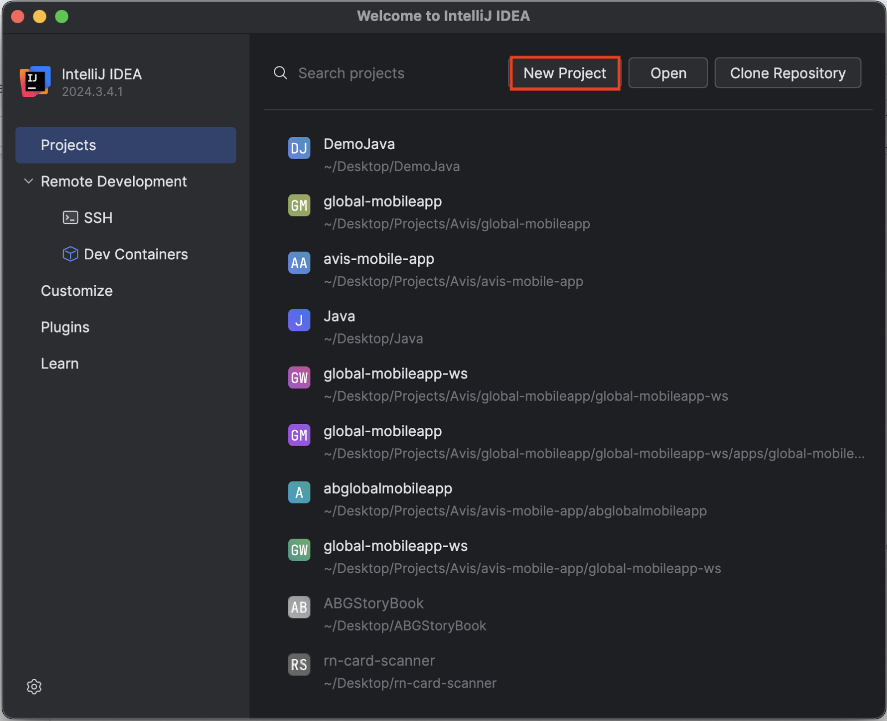
      * Step 2 -> Setup new project
        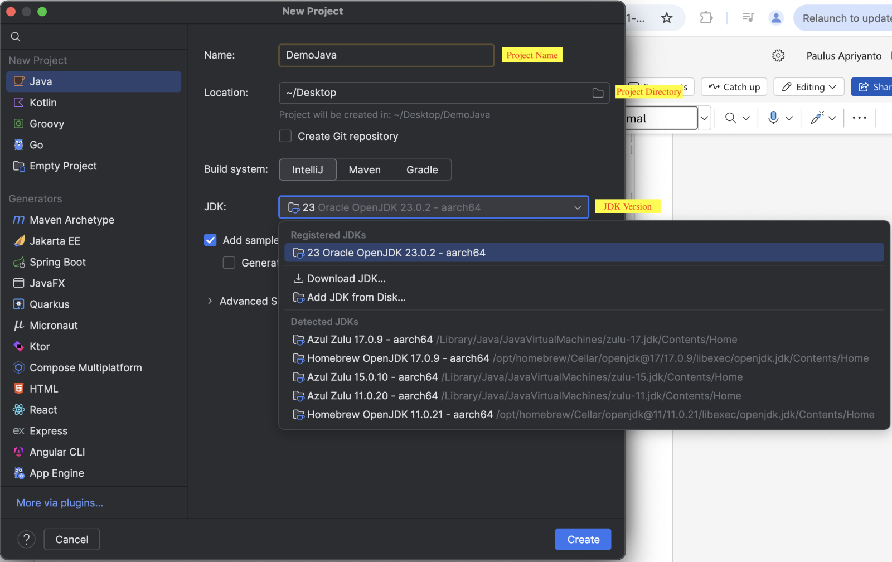
      * Step 3 -> Create a project
* [Visual Studio Code](https://code.visualstudio.com/docs/java/java-spring-boot#_prerequisites)
      * Step 1 -> Install all necessary extensions
        * Spring Boot Extension Pack
            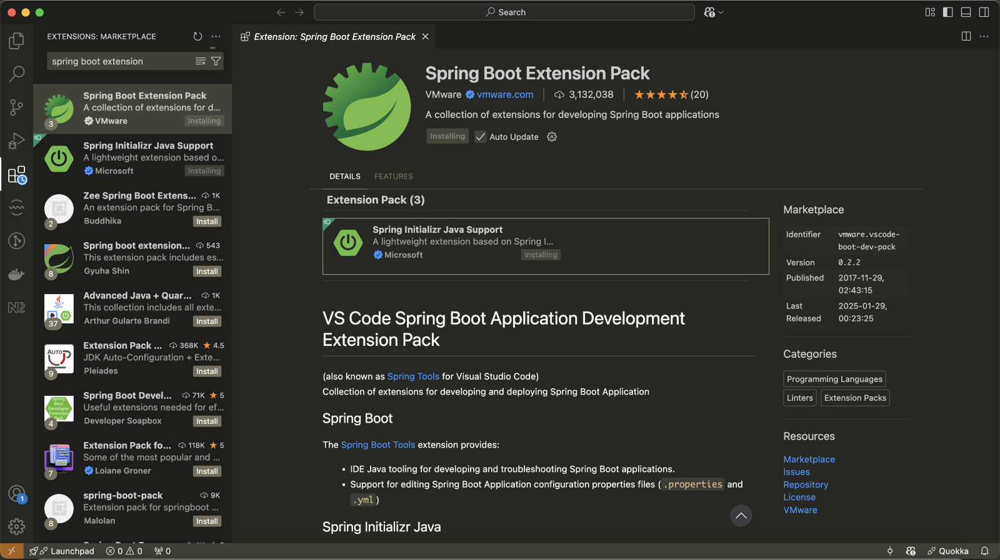
        * Spring Boot Extension Pack
            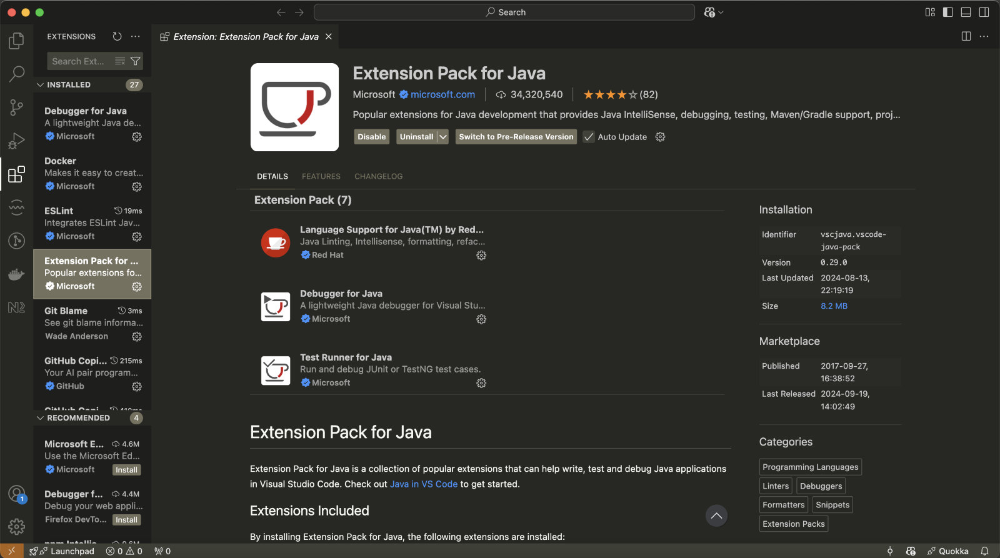
      * Step 2 -> Initiate new project
        * You can go through shortcut `Create Java Project`  and follow the steps, or with bash commands.
            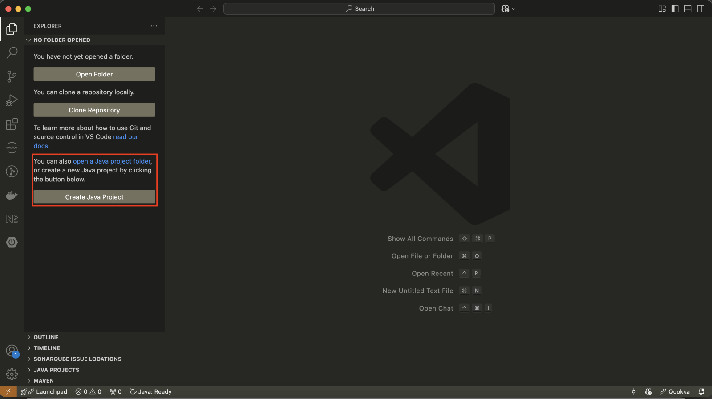
        * `>Spring Initializr: Create a Maven Project`
            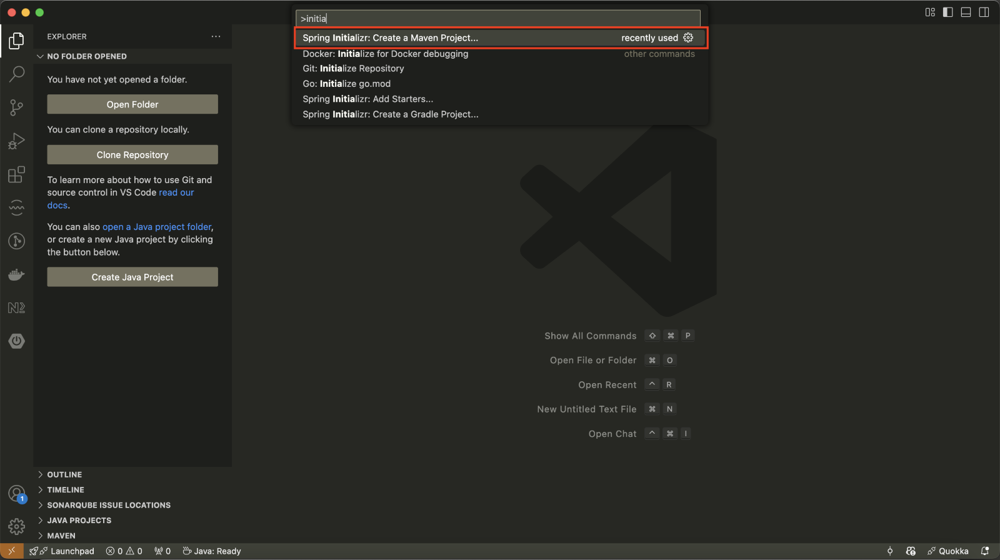
        * Choose JAR (Standalone Applications) packaging type, for modern Spring Boot applications aiming for simplicity and ease of deployment, packaging as a JAR is often recommended.
            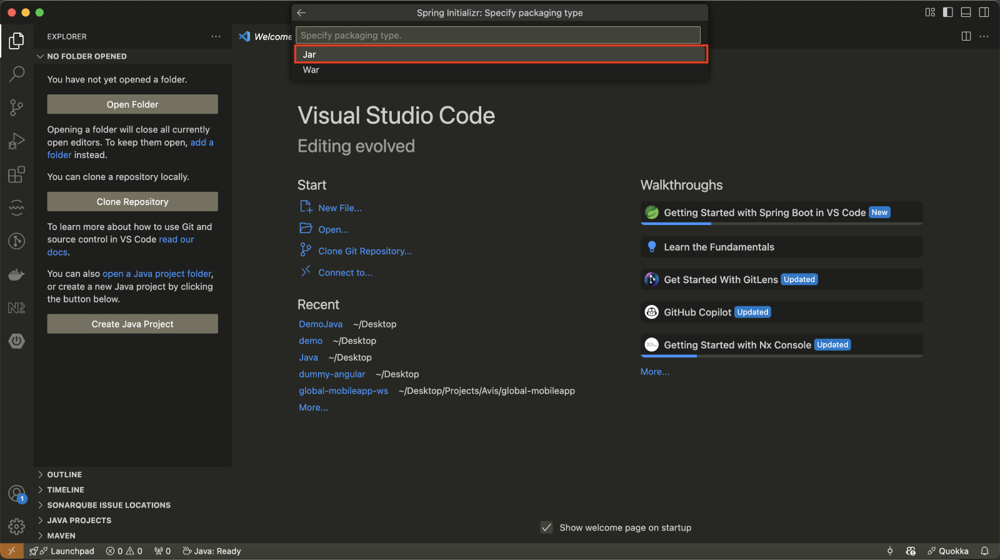

### Folder Structure
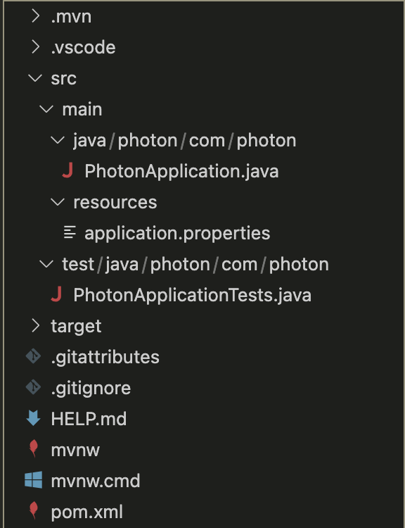

### Adding Dependencies (Visual Studio Code)
* Step1 -> Go to `pom.xml` file
  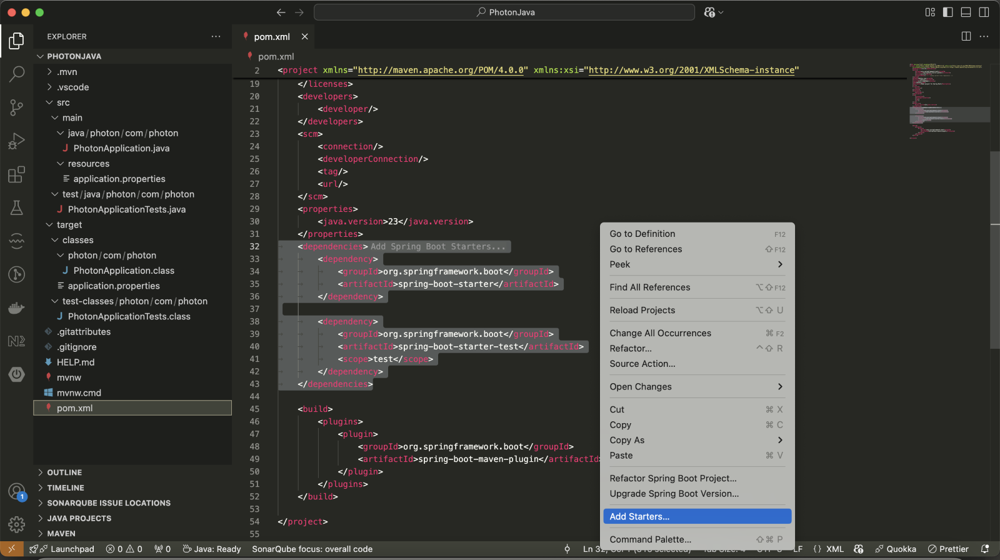
* Step 2 -> Right click and choose `Add Starters`
* Step 3 -> looking for dependencies
  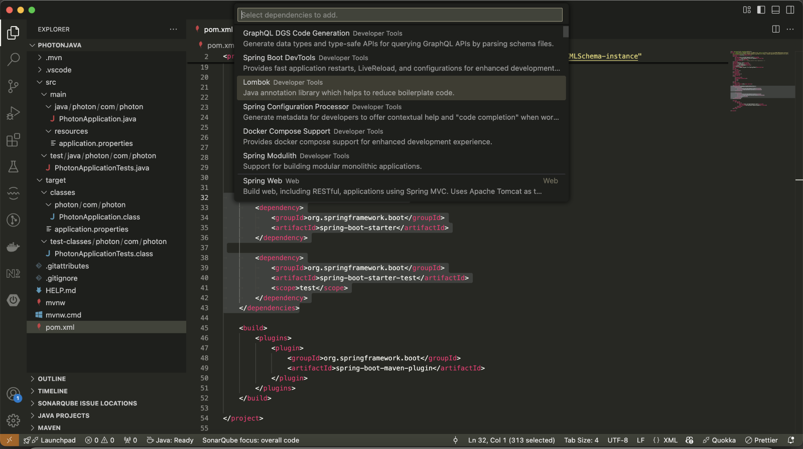
* Step 4 -> Proceed
  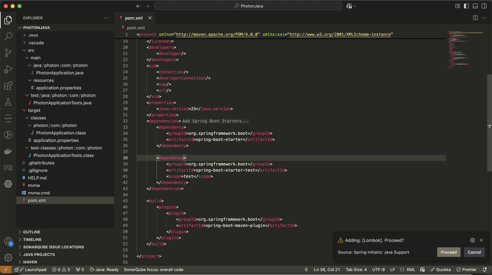
* Step 5 -> Dependency added
  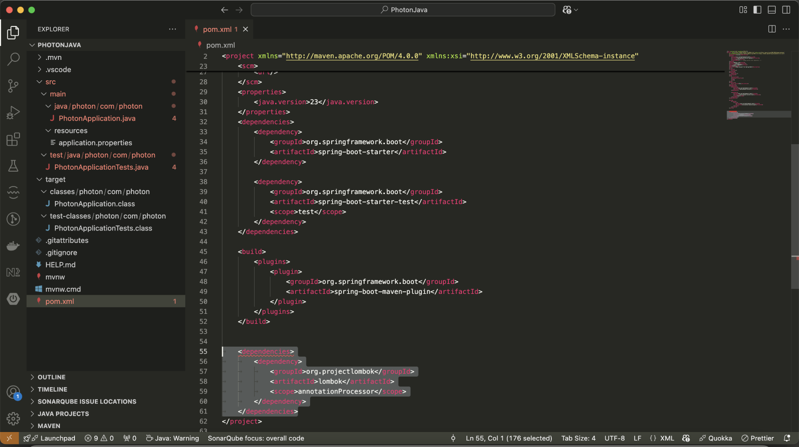

### How to run
* Step 1 -> Install `maven` to your local machine
    * Mac -> `brew install maven`
    * Windows -> [Install](https://maven.apache.org/install.html)
* Step 2 -> go to root project then run this command `mvn spring-boot:run`